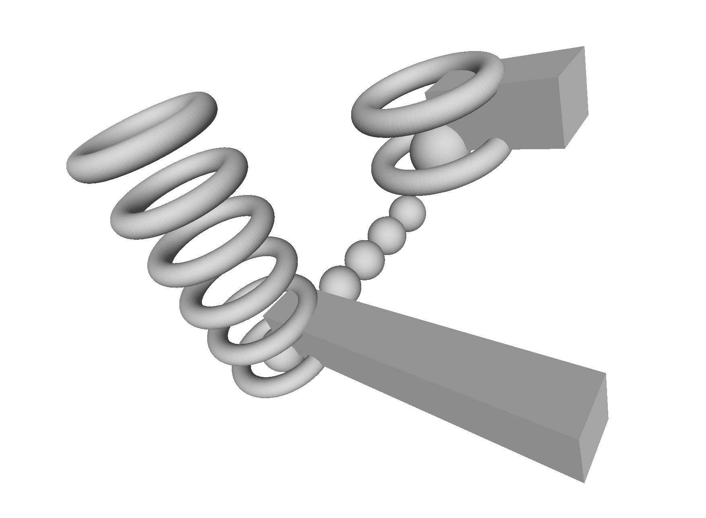
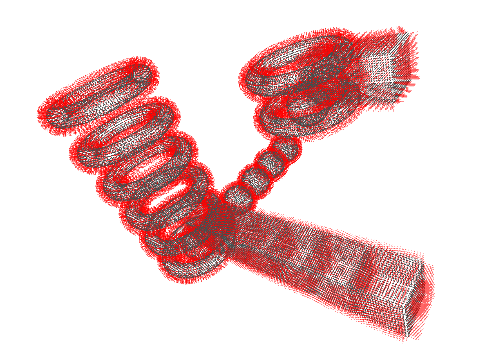

# STEPToPoints

## Description
The program STEPToPoints is a command line utility to generate point clouds out of solids contained in STEP files. The supported output file formats is xyz (vertex positions and normal vectors). A popular viewer for the supported file format is MeshLab (https://www.meshlab.net). STEPToPoints is based on OpenCASCADE (https://www.opencascade.com). The program uses cxxops (https://github.com/jarro2783/cxxopts) for parsing the command line.

## Requirements
 * CMake installation (https://cmake.org)
 * Visual Studio C++ installation (https://visualstudio.microsoft.com)
 * OpenCASCADE installation (https://old.opencascade.com/content/latest-release, download needs registration)

## Usage
Listing the contents (solids) of a STEP file:
`STEPToPoints -c -i <step file>`

Generating point clouds for selected solids of the file:

`STEPToPoints -i <step file> -o <output file> -g <sampling distance> -s <solid1>,<solid2>,<...>`

Following the help text from the command line:
```
STEPToPoints.exe
STEP to point cloud conversion by regular sampling
Usage:
  STEPToPoints [OPTION...]

  -i, --in arg        Input file
  -o, --out arg       Output file
  -c, --content       List content (solids)
  -s, --select arg    Select solids by name or index (comma seperated list,
                      index starts with 1)
  -g, --sampling arg  Sampling distance
  -h, --help          Print usage
```

## Examples

Examples are from the `examples` directory.

### Example Basic Shapes

| Solids |
| :--- |
|  |

| Point cloud with normal vectors |
| :--- |
| `STEPToPoints.exe -i basic_shapes.stp -o out.xyz -g 0.5` |
|  |

## Remarks
This code has been tested with an OpenCASCADE 7.5.0 prebuilt binary (`opencascade-7.5.0-vc14-64.exe`) on Windows, as well as OpenCASCADE system packages on openSUSE Linux. With changes in the configuration section in the `CMakeLists.txt` file the build should also work with other OpenCASCADE versions.